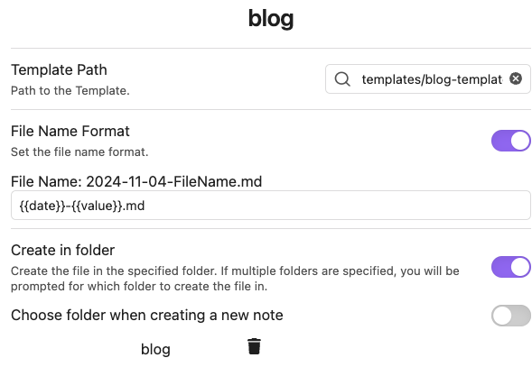
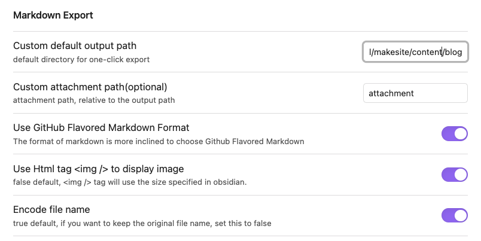

<!-- title:My Simple Obsidian to Github Pages Writing Workflow -->
Writing is hard. But so is publishing your writing. And much like software, publishing is the analog of "going to production" ie. only when your thoughts and writing are in the wild can it really have an impact.

After starting and stopping many articles, only to have dreaded the publishing of the writing, I decided to ditch all the fancy static site generators and go barebones with html and css. 

Well... I actually stumbled upon a [simple, no-frills Python script](https://github.com/sunainapai/makesite) that compiles together markdown files into html. 

With this, I'm able to write my blog post in Obsidian, export it to markdown in the blog project, and then publish the blog post to Github. And within 2 min, I have got it published. 

# Pros and Cons
The cost is 0$. All writing happens locally within Obsidian. And the headache of publishing has nearly gone away.
I can imagine in the near future that the script I have will get quite messy. As I add in more edge cases or features, there will need to be some hands-on maintenance of this workflow.

# How Does it Work
1. Setup a command in Obsidian using the [QuickAdd plugin](https://github.com/chhoumann/quickadd) which pulls a blog template I have into a blog directory within my Vault. 

> Note: My template has `<!-- title:My Simple Obsidian to Github Pages Writing Workflow -->` in the top for the static site script to work properly.

2. Write what I want in the file. 
3. Use the [Markdown Export plugin](https://github.com/bingryan/obsidian-markdown-export-plugin), and set the destination to my directory locally which hosts my blog. 

4. Locally, I can serve my blog and make any UI changes to the html. 
5. ~~Once I'm happy with it, I then publish it with `git subtree push --prefix _site origin gh-pages`~~
   
   **Edit on 2025-01-22:** I have now enabled a Github action which builds the site and then pushes it to the gh-pages branch where Github then serves the folder. This has greatly simplified the deployment process.

You can find all the code related to the blog hosting [here](https://github.com/andrewgy8/my-page). 

## Note
The blog is work in progress, and Im taking it one post at a time to see how it works out. But if you find it useful, by all means go ahead and use this workflow. 

And if you have any questions, feel free to open up an issue and I'll be happy to answer it. 

